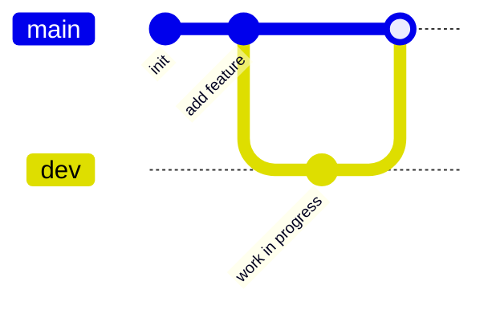
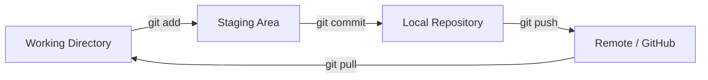

--- #1
theme: seriph
background: /images/L1_intro.jpg
themeConfig:
  primary: '#5d8392'
title: Python Basics & Git
info: false
class: text-center
fonts:
  sans: Lexend
  serif: Roboto Slab
  mono: Fira Code
---

# <span class="blue">Python</span> <span class="dark">Basics</span> <span class="orange">& Git</span>

<style>
.blue {
  color: #006BB6;
}

.dark {
  color: #222222cd;
}

.orange {
  color: #F58426;
}
</style>

<span class="dark">LCD151: Methods in Computational Linguistics I</span>

<span class="dark">Instructor: Han Li</span>


---
layout: two-cols-header

---
 
# Today's Goals

::left::

## 🐍 Python Basics

- Variables & literals
- Data types
- Operators & expressions
- Control flow
- Functions

::right::

## 🔧 Git

- Why version control?
- Core concepts
- Everyday commands
- GitHub workflow
- Best practices

---
layout: default
---
   
# **Python Basics**

---

# First Python 

- A high-level, general-purpose **interpreted** programming language
- Emphasizes readability — code looks close to plain English
- Widely used in NLP, data science, web development, and scripting
- No compilation step: you run `.py` files directly
- But now we will use IDLE

<br>

``` python
>>> print("Hello, World") # print function takes one argument and display whatever you pass
>>> "Hello, World!"
```
<br>

``` python
>>> print("Hello, LCD151!") # You are using the print() function
>>> "Hello, LCD151!"
```


---

# Variables & Literals
- A **variable** is a **name** bound to a value.
- A **literal** is a specific **value** written directly in the code.
  
```python
name = "Auggie"     # string literal
age = "5"           # integer literal
weight = 10.7       # float literal
is_vax = True       # boolean literal
```

---

# Naming Variables


- Case-sensitive (`Name` ≠ `name`)
```python
name = "Auggie"    # string literal
Name = "Bazzie"    # another string literal
print(name == Name)
# False
```

- Must start with a letter or underscore
- Cannot use Python reserved words, such as `if`, `for`, or `class`

```python
# You will get SyntaxError if you do these
151enroll = 32
class = "LCD151"
```
- Use `snake_case` by convention


---

# Basic Data Types

| Type | Example | Description |
|---|---|---|
| `int` | `42` | whole numbers |
| `float` | `3.14` | decimal numbers |
| `str` | `"text"` | sequences of characters |
| `bool` | `True` / `False` | logical values |
| `None` | `None` | NoneType |

<br>
---

# Checking Data Types

Python’s built-in `type()` function tells us the data type of a value.

```python
type(42)          # <class 'int'>
type(3.14)        # <class 'float'>
type("42")        # <class 'str'>
type(True)        # <class 'bool'>
type(None)        # <class 'NoneType'
```
---
 
# Operators & Expressions

```python
# Arithmetic
3 + 2    # 5
3 - 2    # 1
3 * 2    # 6
3 / 2    # 1.5   (true division)
3 // 2   # 1     (floor division)
3 % 2    # 1     (modulo)
3 ** 2   # 9     (exponent)

# Comparison
3 == 2   # False
3 != 2   # True
3 > 2    # True

# Logical
True and False   # False
True or False    # True
not True         # False
```
---

# Practice

1. Can you predict the type? Verify from your IDLE

```python
type(10 / 2)       
type(10 // 2)      
type(1 + 1 == 2)   
type("1" + "1")    
type(1 + 1.0)      
```
<br>

2. Use the built-in function `input()` to ask the user for information

```python
age = input("Enter your age: ")
type(age)  
```
What type is `age`?
<br>

> [!TIP]
> Use `int()`, `float()`, or `str()` to convert a value from one data type to another.
>
> ```python
> age = int(input("Enter your age: "))
> ```

---
layout: section
---

# Part 2: Git & Version Control

---

# Why Version Control?

<v-clicks>

- Track every change to your code over time
- Experiment safely with **branches** — no fear of breaking things
- Collaborate without overwriting each other's work
- Recover previous versions when something breaks
- Industry-standard skill for any programming job

</v-clicks>

<v-click>

> Git is the tool. **GitHub** is a website that hosts Git repositories online.

</v-click>

---

# Core Concepts

| Term | Meaning |
|---|---|
| **Repository (repo)** | A project folder tracked by Git |
| **Commit** | A saved snapshot of changes, with a message |
| **Branch** | An independent line of development |
| **Remote** | A version of the repo hosted elsewhere (e.g. GitHub) |
| **Clone** | Copy a remote repo to your machine |
| **Push / Pull** | Send / receive commits to and from a remote |



---

# Setting Up a Repository

```bash
# Configure your identity (once per machine)
git config --global user.name "Your Name"
git config --global user.email "you@example.com"

# Start tracking a new project
git init

# Or copy an existing project from GitHub
git clone https://github.com/lihan829/151F26.git
```

---

# The Everyday Workflow

```bash
git status              # see what's changed
git add file.py         # stage a specific file
git add .                # stage everything

git commit -m "Add word frequency counter"

git push                 # send commits to GitHub
git pull                 # get latest commits from GitHub
```

<v-click>



</v-click>

---

# Branching & Merging

```bash
git branch feature-x        # create a branch
git checkout feature-x      # switch to it
git checkout -b feature-x   # create + switch in one step

# ... make changes, add, commit ...

git checkout main
git merge feature-x         # bring changes into main
git branch -d feature-x     # delete the branch
```

<v-click>

**Why branch?** Work on a lab or feature without touching the stable `main` branch until it's ready.

</v-click>

---

# Inspecting History

```bash
git log                 # full commit history
git log --oneline        # compact view
git diff                 # unstaged changes
git diff --staged        # staged changes
git show <commit-hash>   # details of one commit
```

```bash
$ git log --oneline
a1b2c3d Add regex lab solution
e4f5g6h Fix off-by-one in loop
h7i8j9k Initial commit
```

---

# GitHub Workflow (Homework Submission)

```bash
# 1. Clone your assignment repo
git clone https://github.com/your-org/lab1-yourname.git
cd lab1-yourname

# 2. Do your work, then check status
git status

# 3. Stage and commit
git add .
git commit -m "Complete Lab 1: variables and expressions"

# 4. Push to GitHub for submission
git push origin main
```

<v-click>

✅ Commit **often**, with clear messages — it's part of your grade trail!

</v-click>

---

# Common Pitfalls & Tips

<v-clicks>

- **Commit small, commit often** — easier to track down bugs
- Write clear commit messages: `"Fix bug"` ❌ → `"Fix off-by-one error in word counter"` ✅
- Always `git pull` before you start working, `git push` when you're done
- Use a `.gitignore` file to avoid committing junk (`__pycache__/`, `.DS_Store`, venvs)
- Merge conflicts aren't scary — Git tells you exactly which lines to resolve
- When in doubt: `git status` tells you where you are

</v-clicks>

---
layout: center
class: text-center
---

# Summary

<div class="grid grid-cols-2 gap-8 mt-8 text-left">
<div>

### 🐍 Python
- Variables, types, operators
- Control flow: `if`, `for`, `while`
- Functions with `def`

</div>
<div>

### 🔧 Git
- `add` → `commit` → `push`
- Branches for safe experimentation
- GitHub for collaboration & submission

</div>
</div>

---
layout: center
class: text-center
---
