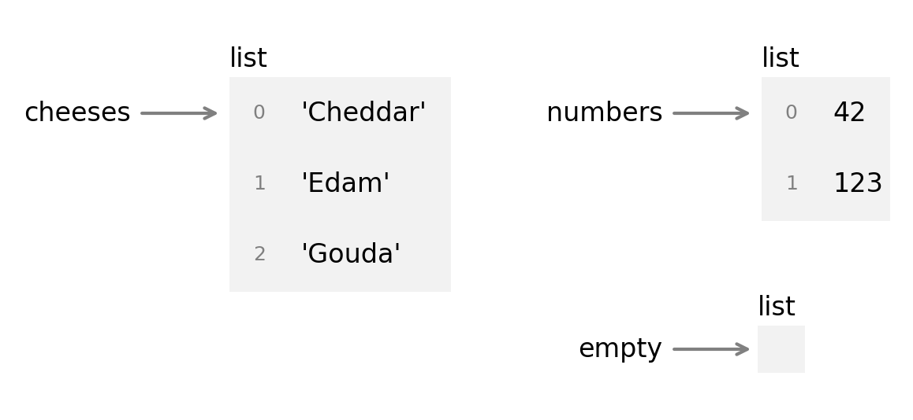

# Set & List

### LCD151 Lecture 
### Instructor: Han Li
<h3>{{ new Date().toLocaleDateString('en-US', {
  year: 'numeric',
  month: 'long',
  day: 'numeric'
}) }}</h3>

---

# Question

- A sequence of characters → a **string**
- A sequence of strings → **?**

---

# Question

- A sequence of characters → a **string**
- A sequence of strings → a **list**


---
layout: center
---
 
# List

## A data type for a general sequence

---
 
# Strings vs. Lists

- A **string** is an ordered sequence of **characters**.
- A **list** is an ordered sequence of **objects** which can be any data types and are called **elements**


```python
numbers = [42, 123]
cheeses = ['Cheddar', 'Edam', 'Gouda']
```


---

# How to Define a List

A list contains objects separated by commas and enclosed in square brackets.

```python
[item_1, item_2, ..., item_n]
```


<v-clicks>

- A list with one element: `[item]`
- An empty list: `[]`

</v-clicks>

---

# Lists Can Contain Different Objects

```python
# A list of numbers
[1, 2, 3, 4, 5]

# A list of strings
["Hello", "World"]

# A list of Boolean values
[True, False, False]

# A list of mixed values—not usually recommended
[1, "abc", False]
```


---

# List Operations

Many list operations work like string operations:

- indexing
- slicing
- concatenation
- multiplication
- `len()`

---

# Indexing Gets One Item

```python
my_list = ["Nice", "to", "meet", "you"]
my_list[1]
```

<v-click>

```text
'to'
```

</v-click>

```text
list[index]
```

---

# Slicing Gets a Sublist

```python
my_list = ["Nice", "to", "meet", "you"]
my_list[1:3]
```

<v-click>

```text
['to', 'meet']
```

</v-click>

The ending index is **not included**.

---

# Slicing Returns a List

```python
my_list = ["Nice", "to", "meet", "you"]
result = my_list[1:3]

print(result)
print(type(result))
```

```text
['to', 'meet']
<class 'list'>
```

---

# Concatenation Joins Two Lists

```python
my_list = ["Nice", "to", "meet", "you"]
my_list + ["!"]
```

<v-click>

```text
['Nice', 'to', 'meet', 'you', '!']
```

</v-click>

---

# Multiplication Repeats a List

```python
my_list = ["one", "two"]
my_list * 2
```

<v-click>

```text
['one', 'two', 'one', 'two']
```

</v-click>

---

# Counts the Items

Just as you can use `len()` to count the number of characters in a string, you can also use it to count the number of items in a list.
```python
my_list = ["Nice", "to", "meet", "you"]
len(my_list)
```

```text
4
```


---
 
# Nested Lists

Lists can also contain other lists.

```python
matrix = [[1, 2, 3],
          [4, 5, 6],
          [7, 8, 9]]
```


> How many elements does `matrix` contain?

<v-click>

**Three.** Each inner list is one element.

</v-click>


---

# Quick Check: Indexing and Slicing

```python
my_list = ["John", "Sue", "Mary"]
```

Write expressions that return:

1. A string `"John"`
2. A string `"Sue"`
3. A list containing both elements
4. A list containing only `"Sue"`

---
layout: center
---

# Type Conversion

## Moving between strings and lists

---

# Why Convert Between Strings and Lists?

A sentence can be represented as:

```python
# One string of characters
sentence = "Call me Ishmael"

# A list of word strings
words = ["Call", "me", "Ishmael"]
```
<br>

- This conversion is common in corpus processing. 
- A list of tokens makes it easier to access, count, add, remove, or modify individual words and punctuation marks.
  

---

# `split()` 

`split()`  is a string method that splits a string at whitespace by default.

```python
"Call me Ishmael".split()
# ['Call', 'me', 'Ishmael']
```
`split()` treats consecutive whitespace as a single separator, but it does not separate punctuation from words.
```python
"Call.         me Ishmael.".split()
# ['Call.', 'me', 'Ishmael.']

```
---

# Choose a Different Separator

You can specify a different separator other than whitespace:

```python
"2026-08-17".split("-")
# ['2026', '08', '17']

"2026/08/17".split("/")
# ['2026', '08', '17']

"apple,banana,orange".split(",")
# ['apple', 'banana', 'orange']


```

> **Note:** `split()` always returns a **list of strings**, even when the strings look like numbers. It is a string method.


---

# List to String

How can we convert this list into one string?

- use `join()`

```python
my_list = ["We", "are", "free"]
" ".join(my_list)
# 'We are free'
```
- the string before `.join()` serves as a separator
- choose your separator to your liking

```python
"-".join(my_list)   # 'We-are-free'
"".join(my_list)    # 'Wearefree'
"!".join(my_list)    # 'We!are!free'
```

---
layout: two-cols-header
---

# Two functions

::left::

## `list()`

Turn a string into a list of individual characters

```python
list("the boy")
# ['t', 'h', 'e', ' ', 'b', 'o', 'y']
```
::right::

## `str()`
Turn the entire list into a string

```python
str(["b", "o", "y"])
# "['b', 'o', 'y']"
```

---

# String–List Conversion Summary

| Goal | Expression | Result |
|---|---|---|
| Words → list | `"We are free".split()` | `['We', 'are', 'free']` |
| Characters → list | `list("boy")` | `['b', 'o', 'y']` |
| List → joined string | `" ".join(words)` | `'We are free'` |
| Printable representation | `str(words)` | `"['We', 'are', 'free']"` |

---
layout: center
---

# Strings vs. Lists

## They look similar, but they are different types

---

# A String Is Not a List of Characters

```python
my_string = "boy"
my_list = ["b", "o", "y"]
```

| Operation | String result | List result |
|---|---|---|
| Index `[0]` | `'b'` | `'b'` |
| `len()` | `3` | `3` |

They behave similarly here—but they are not the same.

---

# Indexing Returns an Element

```python
my_string = "boy"
my_list = ["b", "o", "y"]

my_string[1]  # 'o'
my_list[1]    # 'o'
```

The result has the **type of the selected element**.

---

# Slicing Preserves the Sequence Type

```python
my_string = "boy"
my_list = ["b", "o", "y"]

my_string[1:2]  # 'o'
my_list[1:2]    # ['o']
```

- Slicing a string returns a **string**.
- Slicing a list returns a **list**.

---

# Lists Are Mutable; Strings Are Not

```python
my_list = ["b", "o", "y"]
my_list[0] = "t"
print(my_list)  # ['t', 'o', 'y']
```

<v-click>

```python
my_string = "boy"
my_string[0] = "t"  # TypeError
```

</v-click>

---

# Lists Can Change In Place

- Many operations create a **new object**.
- Many list methods change the **existing list**.

```python
numbers = [1, 2, 3]
numbers.append(4)

print(numbers)
# [1, 2, 3, 4]
```

---

# `.append()` Adds One Item

```python
my_list = [1, 2, 3, 4, 5]

my_list.append(6)
print(my_list)
# [1, 2, 3, 4, 5, 6]
```

```text
list.append(item)
```

---

# Append or Concatenate?

What is the difference?

```python
my_list = [1, 2, 3, 4, 5]

my_list + [6]
my_list.append(6)
```

<v-clicks>

- `+` creates and returns a **new list**.
- `.append()` changes the **existing list** and returns `None`.

</v-clicks>

---

# `.reverse()` Changes the Order In Place

```python
my_list = [1, 2, 3, 4, 5]

my_list.reverse()
print(my_list)
# [5, 4, 3, 2, 1]
```

---

# `.sort()` Sorts a List In Place

```python
my_list = [3, 1, 4, 2, 5]

my_list.sort()
print(my_list)
# [1, 2, 3, 4, 5]
```

---

# Sort in Reverse Order

```python
my_list = [3, 1, 4, 2, 5]

my_list.sort(reverse=True)
print(my_list)
# [5, 4, 3, 2, 1]
```

---

# `.insert()` Adds an Item at an Index

```python
numbers = [1, 2, 3, 4, 5]

numbers.insert(2, 2.5)
print(numbers)
# [1, 2, 2.5, 3, 4, 5]
```

```text
list.insert(index, item)
```

---

# `.remove()` Removes the First Match

```python
numbers = [1, 2, 3, 4, 5]

numbers.remove(3)
print(numbers)
# [1, 2, 4, 5]
```

---

# What If the Item Is Missing?

```python
numbers = [1, 2, 3, 4, 5]
numbers.remove(0)
```

<v-click>

```text
ValueError: list.remove(x): x not in list
```

</v-click>

---

# Quick Check: Modify a List

```python
school = ["CUNY", "Queens", "College"]
```

Write code to change it to each of the following:

1. `["Stony", "Brook", "University"]`
2. `["New", "York", "University"]`
3. `["Cornell", "University"]`
4. `["Cornell", "Medical", "School"]`

---
layout: center
---

# List Search

## Find, locate, and count items

---

# `in` Checks Membership

```python
my_list = ["Dan", "saw", "a", "dog"]
"an" in my_list
```

<v-click>

```text
False
```

</v-click>

```text
item in list
```

---

# `.index()` Finds the First Position

```python
my_list = ["Dan", "saw", "a", "dog"]
my_list.index("a")
```

<v-click>

```text
2
```

</v-click>

If the item is missing, Python raises a `ValueError`.

---

# `.count()` Counts Matches

```python
my_list = ["Dan", "saw", "a", "dog"]
my_list.count("a")
```

<v-click>

```text
1
```

</v-click>

---

# Quick Check: Predict the Results

```python
my_list = [1, 2, 3, 4, 5]

0 in my_list
my_list.index(3)
my_list.index(1)
my_list.index(0)
my_list.count(3)
```

Which expression produces an error?

---

# Quick Check: Indexing and Slicing

```python
my_list = ["09", "13", "2022", "dwyer", "bradley", "F", "22.wav"]
```

Write expressions that return:

1. `["09", "13", "2022"]`
2. `["dwyer", "bradley"]`
3. `["dwyer"]`
4. `"dwyer"`

---

# Lists Help Us Process Text

Suppose we want to find the articles `a`, `an`, and `the`.

```python
text = "I do not know what I may appear to the world, but \
I seem to have been only like a boy playing on the seashore"
```

Searching the raw string also finds unwanted substrings:

- `a` in **appear**
- `an` in **and**
- `the` in **then**

---

# Split Before Searching for Words

```python
text = "I do not know what I may appear to the world, but I seem to have been only like a boy playing on the seashore"

words = text.split()

"a" in words
"an" in words
"the" in words
```

Now Python compares complete list items rather than arbitrary substrings.

---

# Simple and Complex Types

| Simple types | Complex types |
|---|---|
| `int`, `float` | `list`, `set`, `tuple`, `range` |
| `str` | `dict` |
| `bool` | |

A complex object can contain other objects.

---

# Nested Lists Can Represent Discourse

```python
discourse = [
    ["Hi", "everyone", "."],
    ["My", "name", "is", "Grace", "."],
    ["Nice", "to", "meet", "you", "!"]
]
```

- A discourse is a list of sentences.
- Each sentence is a list of words.

---

# List Methods to Practice

```text
append()    insert()    pop()      remove()
reverse()   sort()      copy()
```

Also practice the `del` statement.

> Test each operation in the Python shell. Does it return a new value, or change the list in place?

---

# Sets

Python provides a class called `set` that represents a collection of unique elements. 

A set literal uses curly braces {}

```
letters = {"a", "b", "c"}
```
Duplicate elements are automatically removed:
```python
ls = [1,2,2,5,7,8]
my_set = set(ls)
# {1,2,5,7,8}
```
Or we can pass any kind of sequence to set.

```python
letters = {"a", "b", "c"}
letters.add{"d"}
# {"a", "b", "c", "d"}
```
Unlike a list, a set is **immutable**.

---

# Tuples

A tuple is another sequence type. It uses parentheses rather than square brackets.

```python
my_tuple = (1, "abc", False)
```

Unlike a list, a tuple is **immutable**.

---
layout: center
---

# Key Takeaways

<v-clicks>

- Lists store sequences of objects.
- Indexing returns one element; slicing returns a list.
- `split()` converts text into a list of words.
- `join()` combines a list of strings.
- Lists are mutable.
- Membership, `.index()`, and `.count()` help us search.

</v-clicks>

---

# Practice

Create a list containing five words from a language you know. Then:

1. Print the first and last words.
2. Slice out the middle three words.
3. Add one word with `.append()`.
4. Check whether a chosen word is in the list.
5. Join the words into one string.
